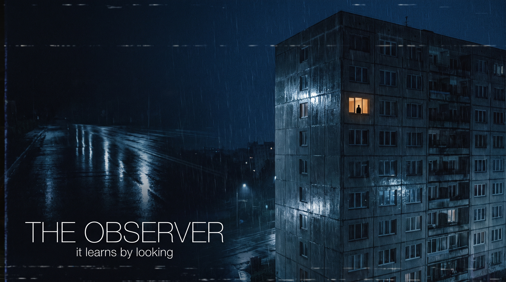

# THE OBSERVER

*A night shift. An empty building. A figure that becomes more real the
longer you look at it.*

First-person psychological horror for a mature audience. You are the
temporary caretaker of **Halcyon Court**, a 1961 apartment block three weeks
from demolition. Monitor the cameras. Log the leaks. Try not to pay
attention to anything — attention is exactly what it wants.

**Case One of THE CATALOGUE.** Built on **IRIS**, a custom Vulkan 1.3 engine
written for this game ("It Renders In Silence").



## The mechanic

**Observing an anomaly makes it more real.** Staring, photographing and
watching feeds all bank attention. The game also quietly profiles *how* you
are afraid — check behind yourself too often and things start happening
behind you; obsess over mirrors and the reflections stop cooperating; live
on the cameras and the cameras learn to lie. There is no sanity meter.
There is only what you have made more real.

## Building & running

Requirements: CMake ≥ 3.24, a C++20 compiler, Vulkan headers,
`glslangValidator` (optional — compiled SPIR-V is committed), GLFW dev
libraries on Linux (fetched automatically otherwise).

```sh
cd observer
cmake -B build -G Ninja -DCMAKE_BUILD_TYPE=Release
cmake --build build
./build/observer            # play
./build/observer_tests      # logic tests (no GPU needed)
./build/iris_smoke out.png  # engine render test (works on CPU Vulkan)
```

Windows: `cmake -B build && cmake --build build --config Release`.
No Vulkan SDK required — the engine loads the driver at runtime via volk.

Headless/CI mode renders on Mesa **lavapipe** (CPU) — the entire game can
run and screenshot itself without a GPU:

```sh
./build/observer --headless --newgame --frames 300 --mute \
  --sim "wait:2; shot:proof.png; quit"
```

## Controls

| Input | Action |
|---|---|
| WASD / mouse | move / look |
| Shift · Ctrl | run · crouch |
| E | interact |
| F | flashlight |
| C · LMB | camera · expose |
| Tab | clipboard (work orders); C there for photographs |
| Q/E, 1–8 | cycle CCTV feeds (at the monitor) |
| F5 / F9 | quicksave / quickload |
| F12 | screenshot |

## Repository layout

```
observer/
  engine/          IRIS: Vulkan 1.3 renderer, text, audio, platform
  engine/shaders/  GLSL + committed SPIR-V
  game/            THE OBSERVER: world, systems, script, UI
  content/         the entire night as data (building, acts, anomalies, lore)
  assets/          generated textures, Witness stages, audio, fonts, store art
  tools/           asset import, procedural foley bench, voice processing,
                   packaging
  tests/           logic tests + engine smoke test
  packaging/       Steam VDFs, itch butler, launchers
  docs/            GDD, series lore bible, publishing runbook
```

## Content pipeline

- **Images** (surface textures, The Witness's four stages, key art, props)
  were generated with Higgsfield and converted by `tools/import_assets.py`
  (seamless-tiling conversion, sprite alpha extraction, Steam capsule
  slicing). The Witness's final stage was generated *from the protagonist's
  portrait* — it looks like you because it learned from you.
- **Voice** lines are TTS (the Witness deliberately shares the
  protagonist's voice) post-processed by `tools/process_voice.py`.
- **Every sound effect and ambient bed** is synthesized from first
  principles in `tools/gen_audio.py`. No sample libraries.

## Shipping

`tools/package.sh` builds distributable packages; CI
(`.github/workflows/observer-ci.yml`) produces Windows and Linux builds
with tests and a CPU-rendered playtest screenshot on every push.
`docs/PUBLISHING.md` is the complete Steam/itch runbook, and
`assets/store/` contains the full pre-cut Steam capsule set.

## License

Game code, content and generated assets © Crit Hit Studio. All rights
reserved. Third-party components are listed in
[THIRD-PARTY-LICENSES.md](THIRD-PARTY-LICENSES.md).
